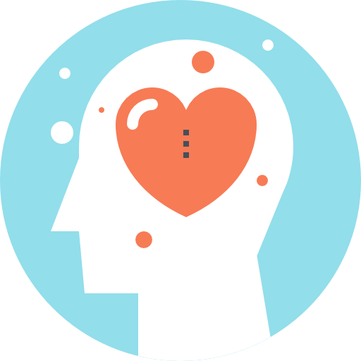

<h1 align="center"> Hi 👋:cloud: </h1>

Hi everyone, I started in this world of Web Development when I was 17 and the reason I decided to started studying by my own is because of my older brother and also because I always was curious of how every page on the Internet works?, how is that kind of interaction with the persons posible?, how complicated it can be? and How can I learn and do all of this? All of that questions get an answer when my brother intruduce me in world of tech.

And since that moment I started to learn faster (at my rythym of course) what I could and getting it to the pratice.

## Interpersonal Skills

| Emotional Intel | CriticalThinking | CreativeThinking | Teamwork |
| --- | --- | --- | --- |
|||||
